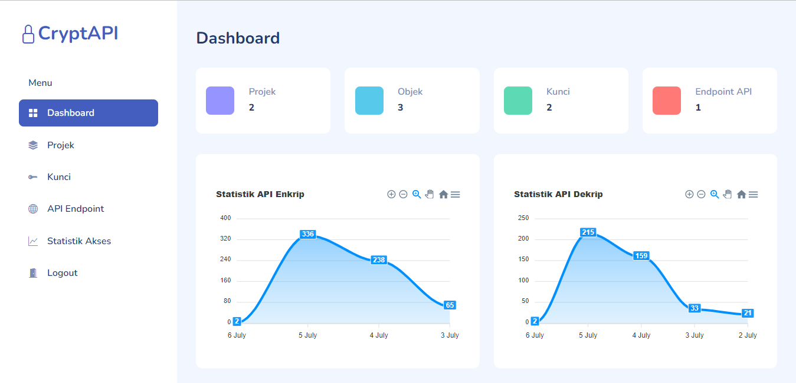

# CryptAPI
CryptAPI merupakan aplikasi manajemen kunci sederhana berbasis Web API dibuat menggunakan bahasa pemrograman PHP dan Framework CodeIgniter 3.
Digunakan untuk melakukan proses kriptografi menggunakan API.

## Instalasi
 1. Lakukan instalasi aplikasi yang dibutuhkan sebagai berikut
	 - Web Server
     - PHP versi 7.4
     - Database Server Mysql 
2.  Import berkas database crypapi.sql.  
3.  Pindahkan kode sumber ke root directory dari Web Server.  
4.  Buka configuration.php sesuai kan variabel koneksi yang ada pada file tersebut.  
5.  Website siap digunakan.
6. Username bawaan **admin** dan passwoord **admin**.

## Pustaka
Tersedia juga pustaka untuk koneksi menggunakan framework Codeigniter 3 pada direktori /asset/library/cryptapi.zip

## Tampilan

## Live Demo
* Tautan :[https://cryptapi.abipermana.my.id/](https://cryptapi.abipermana.my.id/User)
* Login Administrator `abi` dan pass `123` 
* Login Pengguna `reza` dan pass `123` 
